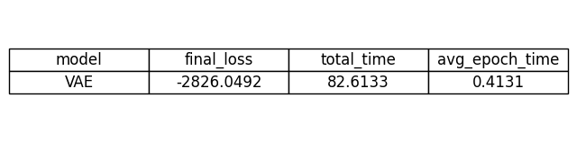
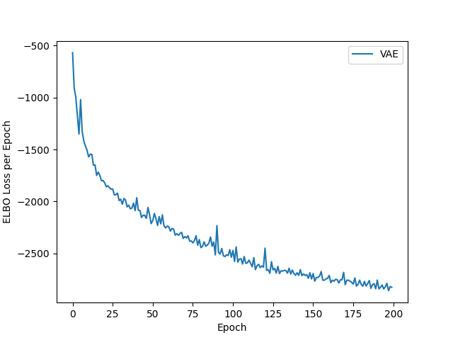
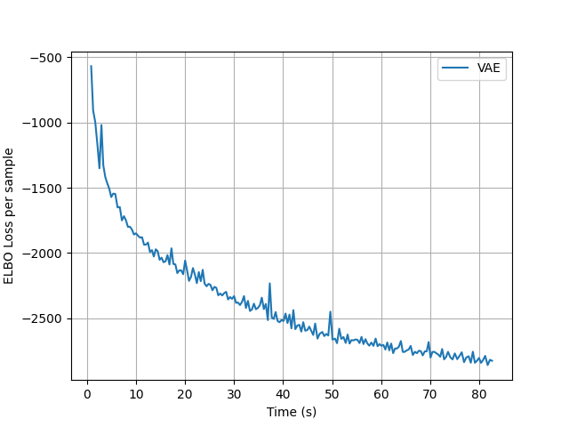
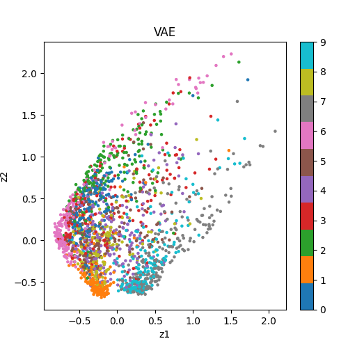

# low-variance-delta-vae

A comparison of vanilla VAEs, deterministic delta-method VAEs, and a low-variance VAE using Hutchinson’s trace estimator.

---

## Motivation

Variational autoencoders (VAEs) rely on stochastic gradient estimators that can introduce high variance during training. This repository explores two alternatives:

* **Deterministic Delta VAE:** Uses the delta method to approximate expectations, removing sampling variance.
* **Low-Variance Delta VAE:** Combines the delta method with Hutchinson’s trace estimator to reduce gradient variance while remaining efficient.

The goal is to study the trade-offs between **bias, variance, training stability, and training efficiency**.

---

## Methods

Three models are included:

1. **Vanilla VAE** – Standard VAE with the reparameterization trick.
2. **Deterministic Delta VAE** – Approximates expectations deterministically using the delta method.
3. **Low-Variance Delta VAE** – Uses the delta method plus Hutchinson’s trace estimator for lower-variance gradient estimates.

All models are implemented in `src/` and share a common training/benchmarking pipeline in `experiments/run.py`.

---

## Results

**Benchmark Table**

*Final per-sample ELBO, total training time, and average epoch time for each model.*



TBA: tables showing gradient variance for each model at initialization and error compared to estimate from large number of monte carlo samples

**Plots**

* **ELBO vs Epochs**
  
  Shows per-sample ELBO (loss) for each model over training epochs.

* **ELBO vs Training Time**
  
  Shows how quickly each model reduces ELBO as a function of cumulative wall-clock time.

* **Latent Space Projections**
  
  2D latent representations for the first `latent_plot_samples` inputs. Colors correspond to digit labels.

---

### Notes

1. All plots are generated by `experiments/run.py` and saved in `results/plots/`.
2. The benchmark table (`results/results_table.png`) is generated from `results/results.csv` and shows a **summary of final metrics per model**.
3. Future models (DeltaVAE, Low-Variance DeltaVAE) can be added to the `models` dictionary in `run.py` and will automatically appear in plots and the table.

---

## Installation

```bash
git clone https://github.com/shonczinner/low-variance-delta-vae
cd low-variance-delta-vae
pip install -r requirements.txt
```

---

## Reproducing Results

Run the benchmarking pipeline:

```bash
python experiments/run.py
```

* This will train all defined models (currently just VAE), generate comparative plots, and save the CSV/PNG results in `results/`.
* Add new models in the `models` dictionary in `run.py` to include them in future experiments.